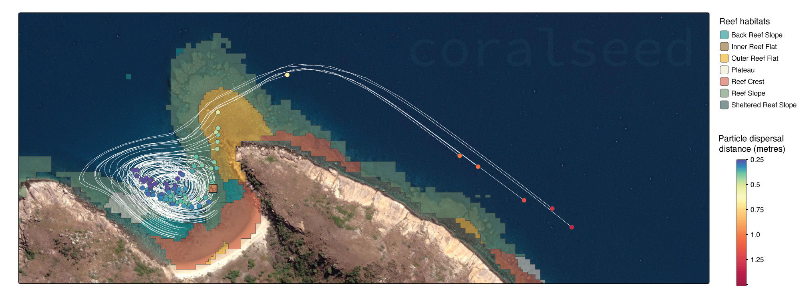

# coralseed v1.0.1



<!-- badges: start -->

[](https://CRAN.R-project.org/package=coralseed) [](https://lifecycle.r-lib.org/articles/stages.html#stable)

<!-- badges: end -->

`coralseed` is a spatially explicit probabilistic model aims to quantify the spatial footprint of coral larval re-seeding from restoration progjects. The model is based on input from high-resolution oceanographic models ([CONNIE](https://connie.csiro.au)) that tracking individual particles through space and time. By parameterising larval behaviour (competency, habitat specific substrate settlement preferences, swimming behaviour) individual-based probability of settlement can be modelled for 10^5^ - 10^7^ larvae. Individual-based settlement probability an dispersal paths then overlaid onto high-resolution habitat maps ([Allen Coral Atlas](https://www.allencoralatlas.org)) to form a spatially-explicit model of settlement following release of coral larvae.

`coralseed` aims to provide insight into key knowledge gaps in larval restoration:

-   Where do larvae settle following release?
-   What is the spatial footprint of larval reseeding projects?
-   what are the likely densities of settled corals?
-   What densities of adult corals (\~10cm size) are produced from reseeding and where are they located?

By varying initial model parameters (e.g. tidal currents, time of release, larval competency, larval densities, location of release sites), a simulation modelling approach can be used to quantify the likely spatial footprint and expected settlement densities, allowing for optimisation and upscaling of larval reseeding programs on the Great Barrier Reef and elsewhere.

## Installation

`coralseed` can be installed on github

``` r
#install.packages("remotes")
install_github("marine-ecologist/coralseed")
```

Below is a base parameterisation of coralseed across a 6.95hr time period (limit_time) with an exponential time-to-settlement model parameterisation (competency.function) with a type I mortality curve (simulate.mortality) applied to 10% of the population over a 24 hr period (simulate.mortality.n) with an additive settlement function (probability).

``` r
library(coralseed)
library(ggplot2)
library(tidyverse)
library(sf)
library(tmap)

sf_use_s2(FALSE)

## 0. Load example datasets

lizard_benthic_map <- st_read("../data-aux/Lizard-20250314042923/Benthic-Map/benthic.geojson", quiet=TRUE)
lizard_reef_map <- st_read("../data-aux/Lizard-20250314042923/Geomorphic-Map/geomorphic.geojson", quiet=TRUE)
lizard_particles <- st_read("../data-aux/run_day_12036_lizard_del_14_1512_sim1_10K_10.json", quiet=TRUE)


## 1. simulate settlement probabilities from habitat maps
# `seascape_probability` takes coral atlas inputs and a data.frame of settlement
# probability (mean, se) to simulate probability of settlement in habitats surrounding the release area

lizard_seascape <- seascape_probability(reefoutline=lizard_reef_map, habitat=lizard_benthic_map)


## 2. seed particles from dispersal model and simulate competency
# `seed_particles` outputs summary statistics and a four panel diagnostic plot


lizard_particles <- seed_particles(input = "../data-aux/run_day_12036_lizard_del_14_1512_sim1_10K_10.json",
                                   zarr = FALSE,
                                   set.centre = TRUE,
                                   seascape = lizard_seascape,
                                   probability = "additive",
                                   limit.time = 12,
                                   competency.function = "exponential",
                                   crs = 20353,
                                   simulate.mortality = "typeIII",
                                   simulate.mortality.n = 0.1,
                                   return.plot = TRUE,
                                   return.summary = TRUE,
                                   silent = FALSE)
                                   
## 3. simulate settlement of particles
# `settle_particles` then applies probability across the seascape to simulate spatially
# explicit patterns of settlement across the seascape:


lizard_settlers <- settle_particles(lizard_particles,
                                    probability = "additive",
                                    return.plot=FALSE,
                                    silent = TRUE)

lizard_settlement_density <- settlement_density(lizard_settlers$points)


## 4. Map combined coralseed outputs
# `map_coralseed` visualises all outputs from the above three models


map_coralseed(seed_particles_input = lizard_particles,
              settle_particles_input = lizard_settlers,
              settlement_density_input = lizard_settlement_density,
              seascape_probability = lizard_seascape,
              restoration.plot = c(100,100),
              show.footprint = TRUE,
              show.tracks = TRUE,
              subsample = 1000,
              webGL = TRUE)
```
