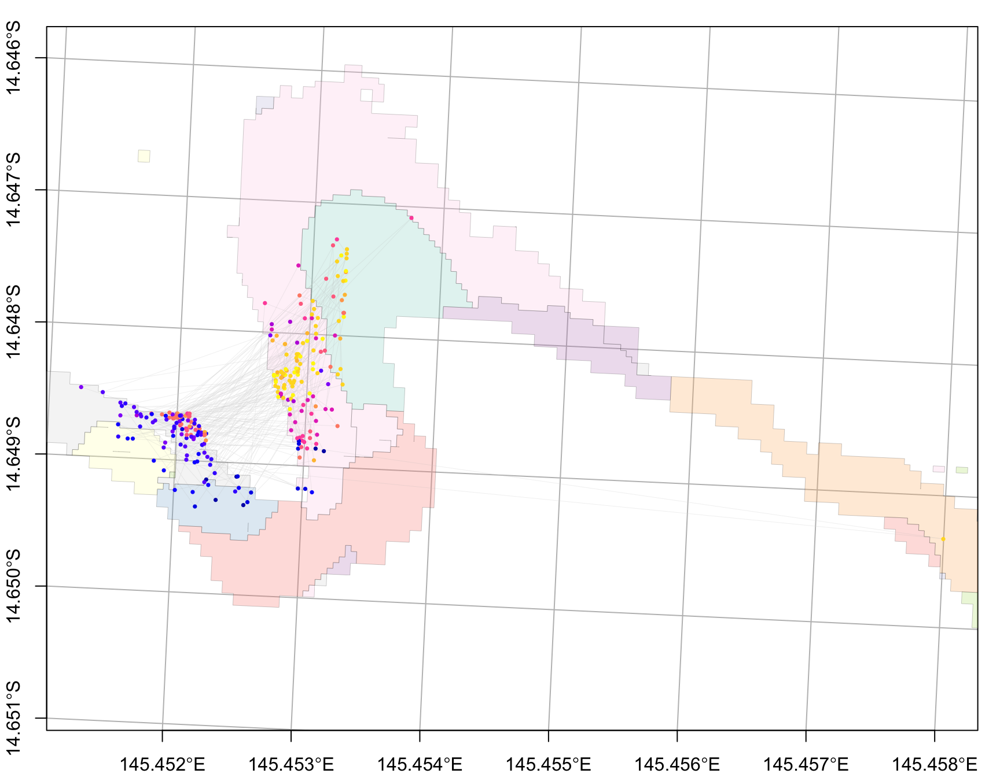
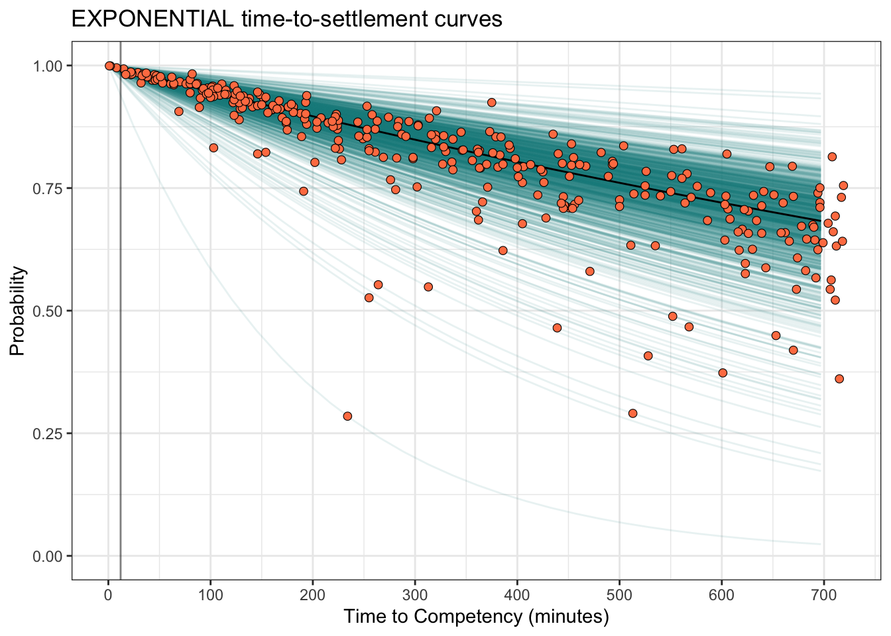

# End-to-end coralseed workflow: Lizard Island

## Overview

This tutorial runs the core `coralseed` workflow for a simulated
reseeding event at Lizard Island:

1.  load reef and benthic habitat maps;
2.  convert habitat classes into a spatial seascape
    settlement-probability surface;
3.  seed particles from an external dispersal model;
4.  simulate settlement;
5.  estimate settlement density and settlement summaries;
6.  visualise the output.

``` r
library(coralseed)
library(tidyverse)
library(sf)
library(tmap)
library(ggplot2)

sf::sf_use_s2(FALSE)
```

## Load example spatial data

The package includes Lizard Island example data in `inst/extdata`. These
are accessed with
[`system.file()`](https://rdrr.io/r/base/system.file.html) so the
tutorial works after installation.

``` r
lizard_benthic_map <- system.file(
  "extdata", "Lizard_Benthic.geojson",
  package = "coralseed"
) |>
  sf::st_read(quiet = TRUE)

lizard_reef_map <- system.file(
  "extdata", "Lizard_Geomorphic.geojson",
  package = "coralseed"
) |>
  sf::st_read(quiet = TRUE)

lizard_particles_sf <- system.file(
  "extdata", "lizard_del_14_1512_sim1_10.json",
  package = "coralseed"
) |>
  sf::st_read(quiet = TRUE)
```

## Build the seascape probability surface

[`seascape_probability()`](https://marine-ecologist.github.io/coralseed/reference/seascape_probability.md)
combines reef geomorphology and benthic habitat maps and assigns
settlement probabilities to habitat classes.

``` r
lizard_seascape <- seascape_probability(
  reefoutline = lizard_reef_map,
  habitat = lizard_benthic_map
)

lizard_seascape
```

    Simple feature collection with 669 features and 3 fields
    Geometry type: POLYGON
    Dimension:     XY
    Bounding box:  xmin: 1628792 ymin: 8347643 xmax: 1633662 ymax: 8354525
    Projected CRS: AGD84 / AMG zone 53
    # A tibble: 669 × 4
    # Groups:   class [7]
       class                              geometry habitat_id settlement_probability
     * <chr>                         <POLYGON [m]> <chr>                       <dbl>
     1 Back Reef Slope ((1629141 8349637, 1629142… Back_Reef…                   0.46
     2 Back Reef Slope ((1629009 8350083, 1629009… Back_Reef…                   0.54
     3 Back Reef Slope ((1628986 8350109, 1628985… Back_Reef…                   0.57
     4 Back Reef Slope ((1628986 8350114, 1628986… Back_Reef…                   0.45
     5 Back Reef Slope ((1628996 8350109, 1628997… Back_Reef…                   0.68
     6 Back Reef Slope ((1628948 8350136, 1628938… Back_Reef…                   0.45
     7 Back Reef Slope ((1629017 8350158, 1629017… Back_Reef…                   0.52
     8 Back Reef Slope ((1628929 8350162, 1628929… Back_Reef…                   0.76
     9 Back Reef Slope ((1629009 8350189, 1629009… Back_Reef…                   0.64
    10 Back Reef Slope ((1629014 8350189, 1629014… Back_Reef…                   0.47
    # ℹ 659 more rows

``` re
ggplot(lizard_seascape) +
  geom_sf(aes(fill = settlement_probability), colour = NA) +
  scale_fill_viridis_c(na.value = "grey90") +
  labs(
    fill = "Settlement\nprobability",
    title = "Lizard Island settlement-probability seascape"
  ) +
  theme_bw()
```

## Seed particles

[`seed_particles()`](https://marine-ecologist.github.io/coralseed/reference/seed_particles.md)
takes particle positions from an external dispersal model and adds
biological filters, including time limits, competency, mortality, and
settlement probability.

``` r
lizard_particles <- seed_particles(
  input = lizard_particles_sf,
  zarr = FALSE,
  set.centre = TRUE,
  seascape = lizard_seascape,
  probability = "additive",
  limit.time = 12,
  competency.function = "exponential",
  crs = 20353,
  simulate.mortality = "typeIII",
  simulate.mortality.n = 0.1,
  return.plot = TRUE,
  return.summary = TRUE,
  silent = FALSE
)
```

Inspect the returned object.

``` r
names(lizard_particles)
```

    [1] "seed_particles" "multiplot"      "summary"       

``` r
lizard_particles$summary
```

                         Metric               Value
    1 Number of particle tracks                1000
    2              Seed setting       [No seed set]
    3                Start time          2022-12-16
    4                  End time 2022-12-16 12:57:00
    5      Dispersal time (hrs)               12.95
    6   Total mortality by tmax                  70

## Settle particles

[`settle_particles()`](https://marine-ecologist.github.io/coralseed/reference/settle_particles.md)
applies spatial settlement probability and returns the simulated settled
subset.

``` r
lizard_settlers <- settle_particles(
  lizard_particles,
  probability = "additive",
  return.plot = FALSE,
  silent = TRUE
)

names(lizard_settlers)
```

    [1] "points" "paths" 

## Plot settled particles

``` r
plot_particles(
  lizard_settlers$points,
  lizard_seascape
)
```



## Estimate settlement density

[`settlement_density()`](https://marine-ecologist.github.io/coralseed/reference/settlement_density.md)
converts settled particles into a spatial density surface.

``` r
lizard_settlement_density <- settlement_density(
  lizard_settlers$points
)

lizard_settlement_density
```

    $count
    Simple feature collection with 518 features and 1 field
    Geometry type: POLYGON
    Dimension:     XY
    Bounding box:  xmin: 1630920 ymin: 8354121 xmax: 1631660 ymax: 8354401
    Projected CRS: AGD84 / AMG zone 53
    First 10 features:
                                    x count
    1  POLYGON ((1630920 8354121, ...    NA
    2  POLYGON ((1630940 8354121, ...    NA
    3  POLYGON ((1630960 8354121, ...    NA
    4  POLYGON ((1630980 8354121, ...    NA
    5  POLYGON ((1631000 8354121, ...    NA
    6  POLYGON ((1631020 8354121, ...    NA
    7  POLYGON ((1631040 8354121, ...    NA
    8  POLYGON ((1631060 8354121, ...    NA
    9  POLYGON ((1631080 8354121, ...    NA
    10 POLYGON ((1631100 8354121, ...    NA

    $density
    Simple feature collection with 518 features and 2 fields
    Geometry type: POLYGON
    Dimension:     XY
    Bounding box:  xmin: 1630920 ymin: 8354121 xmax: 1631660 ymax: 8354401
    Projected CRS: AGD84 / AMG zone 53
    First 10 features:
                                    x count density
    1  POLYGON ((1630920 8354121, ...    NA      NA
    2  POLYGON ((1630940 8354121, ...    NA      NA
    3  POLYGON ((1630960 8354121, ...    NA      NA
    4  POLYGON ((1630980 8354121, ...    NA      NA
    5  POLYGON ((1631000 8354121, ...    NA      NA
    6  POLYGON ((1631020 8354121, ...    NA      NA
    7  POLYGON ((1631040 8354121, ...    NA      NA
    8  POLYGON ((1631060 8354121, ...    NA      NA
    9  POLYGON ((1631080 8354121, ...    NA      NA
    10 POLYGON ((1631100 8354121, ...    NA      NA

    $area
    Simple feature collection with 1 feature and 1 field
    Geometry type: POLYGON
    Dimension:     XY
    Bounding box:  xmin: 1630920 ymin: 8354121 xmax: 1631653 ymax: 8354394
    Projected CRS: AGD84 / AMG zone 53
                            polygons        area
    1 POLYGON ((1630952 8354208, ... 61063 [m^2]

## Summarise settlement

[`settlement_summary()`](https://marine-ecologist.github.io/coralseed/reference/settlement_summary.md)
gives spatially explicit summary metrics, usually binned to a selected
cell size.

``` r
lizard_settlement_summary <- settlement_summary(
  lizard_particles,
  lizard_settlers,
  cellsize = 50
)

lizard_settlement_summary
```

                                                   Description            Value
    1                                   1) Settlement success:                -
    2                                 How many larvae settled?              272
    3                 What percent of released larvae settled?             27.2
    4                                    2) Time to settlement                -
    5                 What was the average time to settlement?               12
    6                 What was the min/max time to settlement?               12
    7                                       3) Larval distance                -
    8    How far on average did larvae travel before settling?              313
    9                  What is the max of dispersal distances?           1200.2
    10                                  4) Dispersal footprint                -
    11 What is the total spatial footprint of the restoration? 64380.1488469933
    12         How many gridcells were seeded within the area?               58
    13                  What is the median count per gridcell?                3
    14                    What is the max counts per gridcell?               24
    15                             What is the median density?           0.0075
    16                                      5) Spatial pattern                -
    17                         How far apart are the settlers? 5.95970772801065
    18                         How clustered are the settlers?             0.27
                                     Units
    1                                    -
    2       Total number of larvae settled
    3           Percent settlement success
    4                                    -
    5              Median settlement (hrs)
    6             Min/max settlement (hrs)
    7                                    -
    8                    Distance (meters)
    9                    Distance (meters)
    10                                   -
    11                           Meters ^2
    12                   n grids (50*50,m)
    13                     count (50*50,m)
    14                     count (50*50,m)
    15                   density (50*50,m)
    16                                   -
    17 Nearest-neighbour distance (metres)
    18                   Clark-Evans index

## Interactive map

Interactive leaflet widgets can be heavy in pkgdown builds. For stable
documentation, the live
[`map_coralseed()`](https://marine-ecologist.github.io/coralseed/reference/extract_parallel.md)
call is shown but not evaluated by default.

``` r
map_coralseed(
  seed_particles_input = lizard_particles,
  settle_particles_input = lizard_settlers,
  settlement_density_input = lizard_settlement_density,
  seascape_probability = lizard_seascape,
  restoration.plot = c(100, 100),
  show.footprint = TRUE,
  show.tracks = TRUE,
  subsample = 1000,
  webGL = TRUE
)
```

To save a stable HTML widget for pkgdown:

``` r
lizard_map <- map_coralseed(
  seed_particles_input = lizard_particles,
  settle_particles_input = lizard_settlers,
  settlement_density_input = lizard_settlement_density,
  seascape_probability = lizard_seascape,
  restoration.plot = c(100, 100),
  show.footprint = TRUE,
  show.tracks = TRUE,
  subsample = 1000,
  webGL = TRUE
)

fs::dir_create("vignettes/www")
htmlwidgets::saveWidget(
  lizard_map,
  "vignettes/www/lizard_map.html",
  selfcontained = TRUE
)
```

Then embed it manually:

## Model flowchart

``` r
flowchart_coralseed(
  lizard_particles,
  lizard_settlers,
  multiplier = 1000,
  postsettlement = 0.8
)
```

##### \[Total particles 1,000,000 \| n tracks 1,000 \| Larvae per track = 1,000 \| Maximum dispersal time = 720 minutes\]

## Key outputs

``` r
list(
  seascape = lizard_seascape,
  seeded_particles = lizard_particles,
  settlers = lizard_settlers,
  settlement_density = lizard_settlement_density,
  settlement_summary = lizard_settlement_summary
)
```

    $seascape
    Simple feature collection with 669 features and 3 fields
    Geometry type: POLYGON
    Dimension:     XY
    Bounding box:  xmin: 1628792 ymin: 8347643 xmax: 1633662 ymax: 8354525
    Projected CRS: AGD84 / AMG zone 53
    # A tibble: 669 × 4
    # Groups:   class [7]
       class                              geometry habitat_id settlement_probability
     * <chr>                         <POLYGON [m]> <chr>                       <dbl>
     1 Back Reef Slope ((1629141 8349637, 1629142… Back_Reef…                   0.46
     2 Back Reef Slope ((1629009 8350083, 1629009… Back_Reef…                   0.54
     3 Back Reef Slope ((1628986 8350109, 1628985… Back_Reef…                   0.57
     4 Back Reef Slope ((1628986 8350114, 1628986… Back_Reef…                   0.45
     5 Back Reef Slope ((1628996 8350109, 1628997… Back_Reef…                   0.68
     6 Back Reef Slope ((1628948 8350136, 1628938… Back_Reef…                   0.45
     7 Back Reef Slope ((1629017 8350158, 1629017… Back_Reef…                   0.52
     8 Back Reef Slope ((1628929 8350162, 1628929… Back_Reef…                   0.76
     9 Back Reef Slope ((1629009 8350189, 1629009… Back_Reef…                   0.64
    10 Back Reef Slope ((1629014 8350189, 1629014… Back_Reef…                   0.47
    # ℹ 659 more rows

    $seeded_particles
    $seeded_particles$seed_particles
    Simple feature collection with 680199 features and 12 fields
    Geometry type: POINT
    Dimension:     XY
    Bounding box:  xmin: 1630876 ymin: 8352221 xmax: 1633558 ymax: 8354455
    Projected CRS: AGD84 / AMG zone 53
    # A tibble: 680,199 × 13
       id    time                dispersaltime settlement_point state competency
     * <chr> <dttm>                      <dbl>            <dbl> <dbl> <chr>
     1 NGI1  2022-12-16 00:00:00             0              720     0 incompetent
     2 NGI1  2022-12-16 00:01:00             1              720     0 incompetent
     3 NGI1  2022-12-16 00:02:00             2              720     0 incompetent
     4 NGI1  2022-12-16 00:03:00             3              720     0 incompetent
     5 NGI1  2022-12-16 00:04:00             4              720     0 incompetent
     6 NGI1  2022-12-16 00:05:00             5              720     0 incompetent
     7 NGI1  2022-12-16 00:06:00             6              720     0 incompetent
     8 NGI1  2022-12-16 00:07:00             7              720     0 incompetent
     9 NGI1  2022-12-16 00:08:00             8              720     0 incompetent
    10 NGI1  2022-12-16 00:09:00             9              720     0 incompetent
    # ℹ 680,189 more rows
    # ℹ 7 more variables: geometry <POINT [m]>, class <fct>, habitat_id <fct>,
    #   settlement_probability <dbl>, settlement_outcome <int>, final <dbl>,
    #   outcome <fct>

    $seeded_particles$multiplot



    $seeded_particles$summary
                         Metric               Value
    1 Number of particle tracks                1000
    2              Seed setting       [No seed set]
    3                Start time          2022-12-16
    4                  End time 2022-12-16 12:57:00
    5      Dispersal time (hrs)               12.95
    6   Total mortality by tmax                  70


    $settlers
    $settlers$points
    Simple feature collection with 272 features and 5 fields
    Geometry type: POINT
    Dimension:     XY
    Bounding box:  xmin: 1630920 ymin: 8354121 xmax: 1631653 ymax: 8354394
    Projected CRS: AGD84 / AMG zone 53
    # A tibble: 272 × 6
    # Groups:   id [272]
       id    class time                dispersaltime          geometry cat
     * <chr> <fct> <dttm>                      <dbl>       <POINT [m]> <fct>
     1 NGI10 Reef… 2022-12-16 11:21:00           681 (1631120 8354296) settled
     2 NGI1… Reef… 2022-12-16 11:31:00           691 (1631108 8354255) settled
     3 NGI1… Reef… 2022-12-16 08:51:00           531 (1631138 8354217) settled
     4 NGI1… Reef… 2022-12-16 08:51:00           531 (1630995 8354224) settled
     5 NGI1… Reef… 2022-12-16 09:28:00           568 (1631009 8354226) settled
     6 NGI1… Reef… 2022-12-16 11:37:00           697 (1631105 8354266) settled
     7 NGI1… Back… 2022-12-16 01:53:00           113 (1631054 8354164) settled
     8 NGI1… Reef… 2022-12-16 08:33:00           513 (1631013 8354210) settled
     9 NGI1… Reef… 2022-12-16 05:21:00           321 (1631082 8354304) settled
    10 NGI1… Oute… 2022-12-16 11:55:00           715 (1631141 8354362) settled
    # ℹ 262 more rows

    $settlers$paths
    Simple feature collection with 272 features and 3 fields
    Geometry type: LINESTRING
    Dimension:     XY
    Bounding box:  xmin: 1630888 ymin: 8354121 xmax: 1631653 ymax: 8354416
    Projected CRS: AGD84 / AMG zone 53
    # A tibble: 272 × 4
       id     dispersaltime                                      geometry.x distance
     * <chr>          <dbl>                                <LINESTRING [m]>      [m]
     1 NGI10          340.  (1631097 8354176, 1631097 8354176, 1631097 835…     441.
     2 NGI105         346.  (1631097 8354176, 1631097 8354176, 1631097 835…     301.
     3 NGI106         266.  (1631097 8354176, 1631091 8354175, 1631085 835…     324.
     4 NGI109         266.  (1631097 8354176, 1631096 8354175, 1631094 835…     380.
     5 NGI110         284   (1631097 8354176, 1631097 8354175, 1631097 835…     399.
     6 NGI118         348.  (1631097 8354176, 1631097 8354176, 1631097 835…     429.
     7 NGI121          56.5 (1631097 8354176, 1631100 8354175, 1631103 835…     121.
     8 NGI129         256.  (1631097 8354176, 1631095 8354176, 1631092 835…     348.
     9 NGI130         160.  (1631097 8354176, 1631097 8354175, 1631096 835…     391.
    10 NGI134         358.  (1631097 8354176, 1631097 8354175, 1631096 835…     579.
    # ℹ 262 more rows


    $settlement_density
    $settlement_density$count
    Simple feature collection with 518 features and 1 field
    Geometry type: POLYGON
    Dimension:     XY
    Bounding box:  xmin: 1630920 ymin: 8354121 xmax: 1631660 ymax: 8354401
    Projected CRS: AGD84 / AMG zone 53
    First 10 features:
                                    x count
    1  POLYGON ((1630920 8354121, ...    NA
    2  POLYGON ((1630940 8354121, ...    NA
    3  POLYGON ((1630960 8354121, ...    NA
    4  POLYGON ((1630980 8354121, ...    NA
    5  POLYGON ((1631000 8354121, ...    NA
    6  POLYGON ((1631020 8354121, ...    NA
    7  POLYGON ((1631040 8354121, ...    NA
    8  POLYGON ((1631060 8354121, ...    NA
    9  POLYGON ((1631080 8354121, ...    NA
    10 POLYGON ((1631100 8354121, ...    NA

    $settlement_density$density
    Simple feature collection with 518 features and 2 fields
    Geometry type: POLYGON
    Dimension:     XY
    Bounding box:  xmin: 1630920 ymin: 8354121 xmax: 1631660 ymax: 8354401
    Projected CRS: AGD84 / AMG zone 53
    First 10 features:
                                    x count density
    1  POLYGON ((1630920 8354121, ...    NA      NA
    2  POLYGON ((1630940 8354121, ...    NA      NA
    3  POLYGON ((1630960 8354121, ...    NA      NA
    4  POLYGON ((1630980 8354121, ...    NA      NA
    5  POLYGON ((1631000 8354121, ...    NA      NA
    6  POLYGON ((1631020 8354121, ...    NA      NA
    7  POLYGON ((1631040 8354121, ...    NA      NA
    8  POLYGON ((1631060 8354121, ...    NA      NA
    9  POLYGON ((1631080 8354121, ...    NA      NA
    10 POLYGON ((1631100 8354121, ...    NA      NA

    $settlement_density$area
    Simple feature collection with 1 feature and 1 field
    Geometry type: POLYGON
    Dimension:     XY
    Bounding box:  xmin: 1630920 ymin: 8354121 xmax: 1631653 ymax: 8354394
    Projected CRS: AGD84 / AMG zone 53
                            polygons        area
    1 POLYGON ((1630952 8354208, ... 61063 [m^2]


    $settlement_summary
                                                   Description            Value
    1                                   1) Settlement success:                -
    2                                 How many larvae settled?              272
    3                 What percent of released larvae settled?             27.2
    4                                    2) Time to settlement                -
    5                 What was the average time to settlement?               12
    6                 What was the min/max time to settlement?               12
    7                                       3) Larval distance                -
    8    How far on average did larvae travel before settling?              313
    9                  What is the max of dispersal distances?           1200.2
    10                                  4) Dispersal footprint                -
    11 What is the total spatial footprint of the restoration? 64380.1488469933
    12         How many gridcells were seeded within the area?               58
    13                  What is the median count per gridcell?                3
    14                    What is the max counts per gridcell?               24
    15                             What is the median density?           0.0075
    16                                      5) Spatial pattern                -
    17                         How far apart are the settlers? 5.95970772801065
    18                         How clustered are the settlers?             0.27
                                     Units
    1                                    -
    2       Total number of larvae settled
    3           Percent settlement success
    4                                    -
    5              Median settlement (hrs)
    6             Min/max settlement (hrs)
    7                                    -
    8                    Distance (meters)
    9                    Distance (meters)
    10                                   -
    11                           Meters ^2
    12                   n grids (50*50,m)
    13                     count (50*50,m)
    14                     count (50*50,m)
    15                   density (50*50,m)
    16                                   -
    17 Nearest-neighbour distance (metres)
    18                   Clark-Evans index
