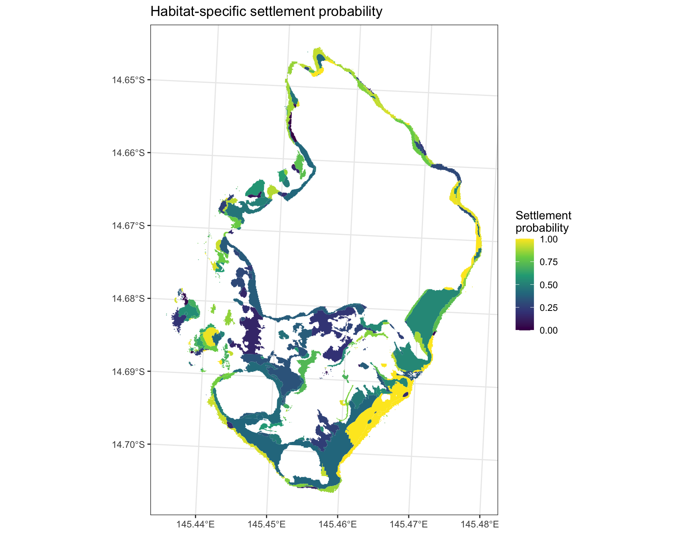
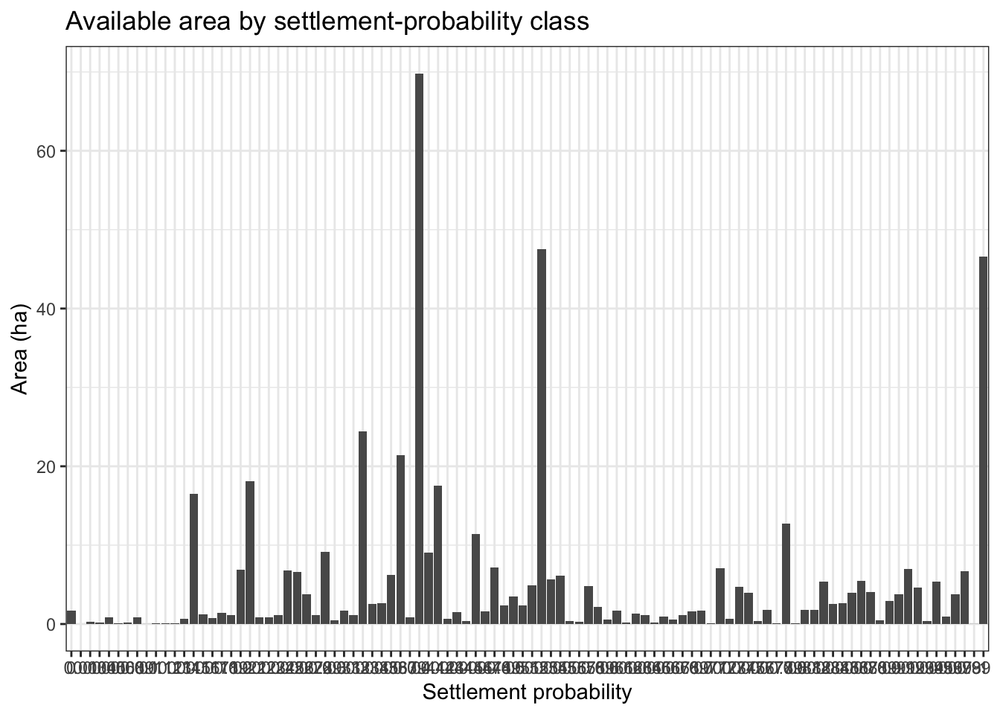

# Build settlement-probability seascapes

## Overview

This tutorial focuses on the spatial habitat component of `coralseed`:
converting reef and benthic maps into a settlement-probability seascape.

``` r
library(coralseed)
library(tidyverse)
library(sf)
library(ggplot2)

sf::sf_use_s2(FALSE)
```

## Load example maps

``` r
benthic_map <- system.file("extdata", "Lizard_Benthic.geojson", package = "coralseed") |>
  st_read(quiet = TRUE)

reef_map <- system.file("extdata", "Lizard_Geomorphic.geojson", package = "coralseed") |>
  st_read(quiet = TRUE)
```

## Inspect habitat classes

``` r
benthic_map |>
  st_drop_geometry() |>
  glimpse()
```

    Rows: 1,573
    Columns: 1
    $ class <chr> "Seagrass", "Coral/Algae", "Coral/Algae", "Rock", "Rubble", "Cor…

``` r
reef_map |>
  st_drop_geometry() |>
  glimpse()
```

    Rows: 412
    Columns: 1
    $ class <chr> "Deep Lagoon", "Plateau", "Reef Slope", "Plateau", "Deep Lagoon"…

``` r
benthic_map |>
  st_drop_geometry() |>
  count(class, sort = TRUE)
```

                class   n
    1     Coral/Algae 475
    2          Rubble 440
    3            Sand 349
    4            Rock 272
    5 Microalgal Mats  29
    6        Seagrass   8

Adjust the `class` column name if the source dataset uses a different
habitat field.

## Create a seascape probability layer

``` r
seascape <- seascape_probability(
  reefoutline = reef_map,
  habitat = benthic_map
)

seascape
```

    Simple feature collection with 669 features and 3 fields
    Geometry type: POLYGON
    Dimension:     XY
    Bounding box:  xmin: 1628792 ymin: 8347643 xmax: 1633662 ymax: 8354525
    Projected CRS: AGD84 / AMG zone 53
    # A tibble: 669 × 4
    # Groups:   class [7]
       class                              geometry habitat_id settlement_probability
     * <chr>                         <POLYGON [m]> <chr>                       <dbl>
     1 Back Reef Slope ((1629141 8349637, 1629142… Back_Reef…                   0.5
     2 Back Reef Slope ((1629009 8350083, 1629009… Back_Reef…                   0.39
     3 Back Reef Slope ((1628986 8350109, 1628985… Back_Reef…                   0.73
     4 Back Reef Slope ((1628986 8350114, 1628986… Back_Reef…                   0.69
     5 Back Reef Slope ((1628996 8350109, 1628997… Back_Reef…                   0.45
     6 Back Reef Slope ((1628948 8350136, 1628938… Back_Reef…                   0.57
     7 Back Reef Slope ((1629017 8350158, 1629017… Back_Reef…                   0.77
     8 Back Reef Slope ((1628929 8350162, 1628929… Back_Reef…                   0.6
     9 Back Reef Slope ((1629009 8350189, 1629009… Back_Reef…                   0.64
    10 Back Reef Slope ((1629014 8350189, 1629014… Back_Reef…                   0.47
    # ℹ 659 more rows

## Visualise the seascape

``` r
ggplot(seascape) +
  geom_sf(aes(fill = settlement_probability), colour = NA) +
  scale_fill_viridis_c(na.value = "grey85") +
  labs(
    title = "Habitat-specific settlement probability",
    fill = "Settlement\nprobability"
  ) +
  theme_bw()
```



## Summarise available settlement habitat

``` r
seascape_area <- seascape |>
  st_transform(20353) |>
  mutate(area_m2 = as.numeric(st_area(geometry))) |>
  st_drop_geometry() |>
  group_by(settlement_probability) |>
  summarise(
    area_m2 = sum(area_m2, na.rm = TRUE),
    .groups = "drop"
  ) |>
  mutate(
    area_ha = area_m2 / 10000,
    prop_area = area_m2 / sum(area_m2, na.rm = TRUE)
  )

seascape_area
```

    # A tibble: 98 × 4
       settlement_probability       area_m2       area_ha prop_area
                        <dbl>         <dbl>         <dbl>     <dbl>
     1                   0    16662.        1.67           3.36e- 3
     2                   0.01     0.0000330 0.00000000330  6.67e-12
     3                   0.03  2603.        0.260          5.26e- 4
     4                   0.04  2157.        0.216          4.36e- 4
     5                   0.05  8776.        0.878          1.77e- 3
     6                   0.06  1240.        0.124          2.50e- 4
     7                   0.08  2157.        0.216          4.36e- 4
     8                   0.09  8876.        0.888          1.79e- 3
     9                   0.1     99.2       0.00992        2.00e- 5
    10                   0.11  1289.        0.129          2.60e- 4
    # ℹ 88 more rows

``` r
ggplot(seascape_area, aes(factor(settlement_probability), area_ha)) +
  geom_col() +
  labs(
    x = "Settlement probability",
    y = "Area (ha)",
    title = "Available area by settlement-probability class"
  ) +
  theme_bw()
```



## Export the seascape

``` r
st_write(
  seascape,
  "outputs/lizard_seascape_probability.gpkg",
  delete_dsn = TRUE
)
```
