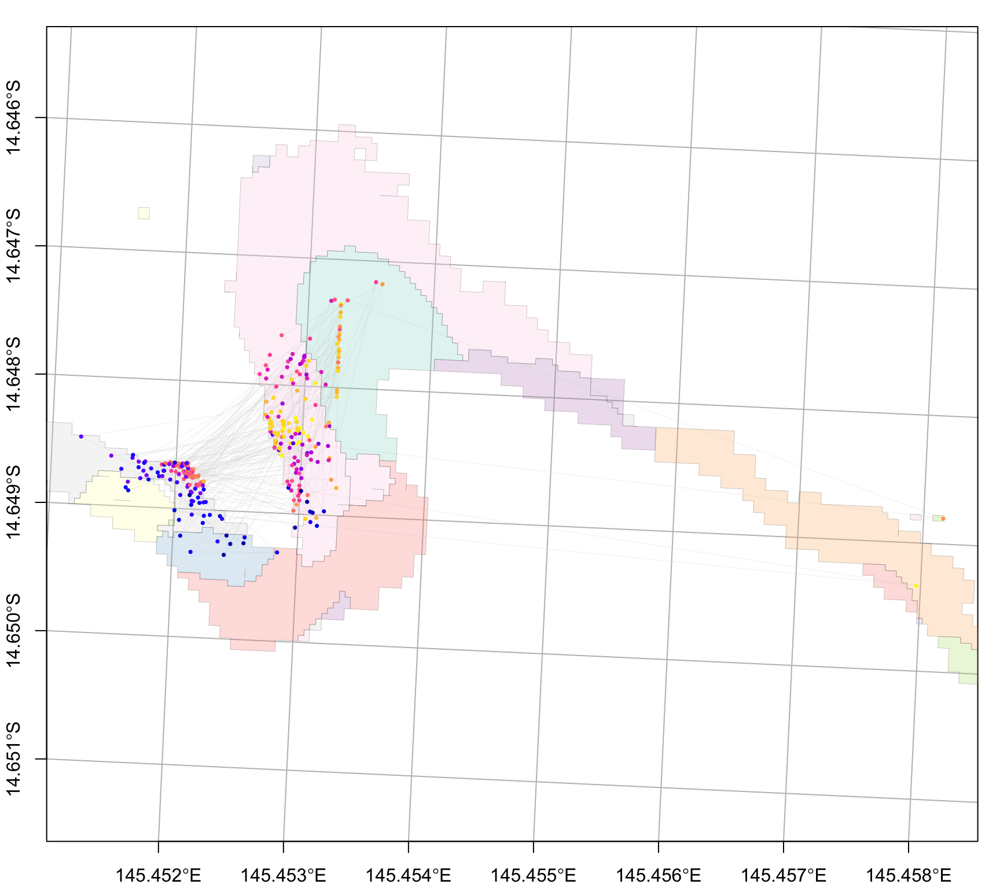

# 2i. coralseed - Lizard Island (nGBR CONNIE)

Simulated reseeding event at Mermaid Bay, Lizard Island

## 1) seed particles

``` r
library(coralseed)
library(ggplot2)
library(tidyverse)
library(sf)
library(tmap)
  
sf_use_s2(FALSE)
  
# load seascape  
lizard_benthic_map <- system.file("extdata", "Lizard_Benthic.geojson", package = "coralseed") |>
                              st_read(quiet=TRUE)

lizard_reef_map <- system.file("extdata", "Lizard_Geomorphic.geojson", package = "coralseed") |>
                              st_read(quiet=TRUE)

lizard_seascape <- seascape_probability(reefoutline=lizard_reef_map, habitat=lizard_benthic_map)

# load particles
lizard_particles_sf <- system.file("extdata", "lizard_del_14_1512_sim1_10.json", package = "coralseed") |> st_read(quiet=TRUE)


# run seed particles
lizard_particles <- seed_particles(lizard_particles_sf,
                              zarr = FALSE,
                              set.centre = TRUE,
                              seascape = lizard_seascape,
                              probability = "additive",
                              limit.time = 12,
                              competency.function = "exponential",
                              crs = 20353,
                              simulate.mortality = "typeIII",
                              simulate.mortality.n = 0.1,
                              return.plot = TRUE,
                              return.summary = TRUE,
                              silent = FALSE)
```

## 2) settle particles

``` r
lizard_settlers <- settle_particles(lizard_particles,
                                    probability = "additive",
                                    return.plot=FALSE,
                                    silent = TRUE)

plot_particles(lizard_settlers$points, lizard_seascape)
```



``` r
lizard_settlement_density <- settlement_density(lizard_settlers$points)
lizard_settlement_summary <- settlement_summary(lizard_particles, lizard_settlers, cellsize=50)
```

## 3) map coralseed

``` r
map_coralseed(seed_particles_input = lizard_particles,
              settle_particles_input = lizard_settlers,
              settlement_density_input = lizard_settlement_density,
              seascape_probability = lizard_seascape,
              restoration.plot = c(100,100),
              show.footprint = TRUE,
              show.tracks = TRUE,
              subsample = 1000,
              webGL = TRUE)
```

## 4) coralseed outputs

``` r
flowchart_coralseed(lizard_particles, lizard_settlers, multiplier=1000, postsettlement=0.8)
```

###### \[Total particles 1,000,000 \| n tracks 1,000 \| Larvae per track = 1,000 \| Maximum dispersal time = 720 minutes\]
