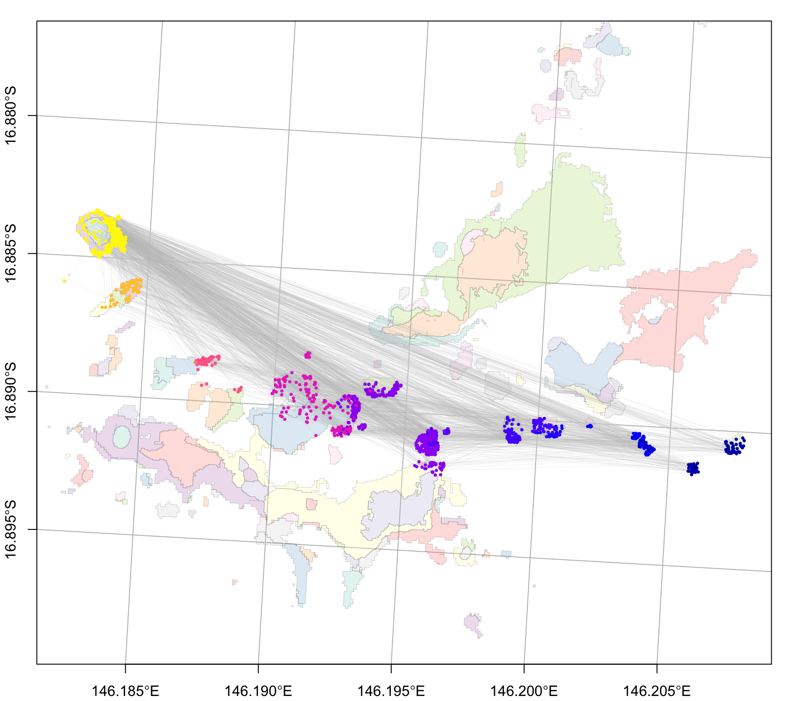

# 3i. coralseed example Moore Reef (cGBR oceanparcels)

Simulated reseeding event at Moore Reef, northern Great Barrier Reef
based on ocean parcels input

## 1) seed particles

``` r
#library(coralseed)
library(ggplot2)
library(tidyverse)
library(sf)
library(tmap)


# load seascape  
moore_benthic_map <- system.file("extdata", "Moore_Benthic.geojson", package = "coralseed") |>
                              st_read(quiet=TRUE)

moore_reef_map <- system.file("extdata", "Moore_Geomorphic.geojson", package = "coralseed") |>
                              st_read(quiet=TRUE)

moore_seascape <- seascape_probability(reefoutline=moore_reef_map, habitat=moore_benthic_map)

# load particles - import example zarr (oceanparcels output)
  {zip_path <- system.file("extdata", "Moore_reseed.zip", package = "coralseed", mustWork = TRUE)
  out_dir <- file.path(tempdir(), "coralseed_Moore_reseed")
  unlink(out_dir, recursive = TRUE, force = TRUE)
  dir.create(out_dir, recursive = TRUE)
  utils::unzip(zip_path, exdir = out_dir)}

moorereef_particles <- import_zarr(file.path(out_dir, "output.zarr"))


# run seed particles
moore_particles <- seed_particles(moorereef_particles,
                            set.centre = TRUE,
                            seascape = moore_seascape,
                            probability = "additive",
                            limit_time = 7,
                            competency.function = "exponential",
                            crs = 20353,
                            simulate.mortality = "typeII",
                            simulate.mortality.n = 0.1,
                            return.plot = TRUE,
                            return.summary = TRUE,
                            silent = FALSE)
```

## 2) settle particles

``` r
moore_settlers <-  settle_particles(moore_particles,
                                    probability = "additive",
                                    silent = TRUE)

plot_particles(moore_settlers$points, moore_seascape)
```



``` r
moore_settlement_density <- settlement_density(moore_settlers$points, cellsize=50)
```

## 3) map coralseed

``` r
map_coralseed(seed_particles_input = moore_particles,
              settle_particles_input = moore_settlers,
              settlement_density_input = moore_settlement_density,
              seascape_probability = moore_seascape,
              restoration.plot = c(100,100),
              show.footprint = TRUE,
              show.tracks = TRUE,
              subsample = 1000,
              webGL = TRUE)
```

## 4) coralseed outputs

``` r
library(networkD3)

flowchart_coralseed(seed_particles_input = moore_particles, 
                    settle_particles_input = moore_settlers, 
                    multiplier = 10000, 
                    postsettlement = 0.8)
```

###### \[Total particles 100,000,000 \| n tracks 10,000 \| Larvae per track = 10,000 \| Maximum dispersal time = 456 minutes\]
