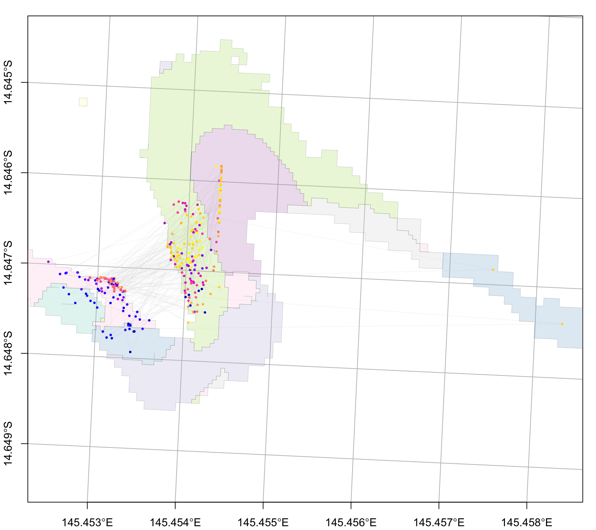

::: cell
```{=html}
<style>
  code, pre {
    font-size: 65%;
    color:darkgrey;
  }
</style>
```
:::

Simulated reseeding event at Mermaid Bay, Lizard Island

# 1) seed particles


::: {.cell}

```{.r .cell-code}
library(coralseed)
library(ggplot2)
library(tidyverse)
library(sf)
library(tmap)
  
sf_use_s2(FALSE)
  
# load seascape  
lizard_benthic_map <- system.file("extdata", "Lizard_Benthic.geojson", package = "coralseed") |>
                              st_read(quiet=TRUE)

lizard_reef_map <- system.file("extdata", "Lizard_Geomorphic.geojson", package = "coralseed") |>
                              st_read(quiet=TRUE)

lizard_seascape <- seascape_probability(reefoutline=lizard_reef_map, habitat=lizard_benthic_map)

# load particles
lizard_particles_sf <- system.file("extdata", "lizard_del_14_1512_sim1_10.json", package = "coralseed") |> st_read(quiet=TRUE)


# run seed particles
lizard_particles <- seed_particles(lizard_particles_sf,
                              zarr = FALSE,
                              set.centre = TRUE,
                              seascape = lizard_seascape,
                              probability = "additive",
                              limit.time = 12,
                              competency.function = "exponential",
                              crs = 20353,
                              simulate.mortality = "typeIII",
                              simulate.mortality.n = 0.1,
                              return.plot = TRUE,
                              return.summary = TRUE,
                              silent = FALSE)
```
:::


# 2) settle particles


::: {.cell}

```{.r .cell-code}
lizard_settlers <- settle_particles(lizard_particles,
                                    probability = "additive",
                                    return.plot=FALSE,
                                    silent = TRUE)

plot_particles(lizard_settlers$points, lizard_seascape)
```

::: {.cell-output-display}
{width=864}
:::

```{.r .cell-code}
lizard_settlement_density <- settlement_density(lizard_settlers$points)
lizard_settlement_summary <- settlement_summary(lizard_particles, lizard_settlers, cellsize=50)
```
:::


# 3) map coralseed


::: {.cell}

```{.r .cell-code}
map_coralseed(seed_particles_input = lizard_particles,
              settle_particles_input = lizard_settlers,
              settlement_density_input = lizard_settlement_density,
              seascape_probability = lizard_seascape,
              restoration.plot = c(100,100),
              show.footprint = TRUE,
              show.tracks = TRUE,
              subsample = 1000,
              webGL = TRUE)
```
:::


<iframe src="../data/www/lizardmap.html" width="100%" height="600" style="border:none;">

</iframe>

# 4) coralseed outputs


::: {.cell}

```{.r .cell-code}
flowchart_coralseed(lizard_particles, lizard_settlers, multiplier=1000, postsettlement=0.8)
```

::: {.cell-output-display}

```{=html}
<h5 style="text-align:center; font-family:arial; color:#9e9e9e;">[Total particles 1,000,000 | n tracks 1,000 | Larvae per track = 1,000 | Maximum dispersal time = 720 minutes]</h5>
<div class="sankeyNetwork html-widget html-fill-item" id="htmlwidget-22433a25190bc32936b1" style="width:100%;height:338px;"></div>
<script type="application/json" data-for="htmlwidget-22433a25190bc32936b1">{"x":{"links":{"source":[0,0,0,1,1],"target":[1,2,3,4,5],"value":[254,657,89,50.79999999999999,203.2],"group":["settled","dispersed","dead","alive","post"]},"nodes":{"name":["Released Larvae [1,000,000]","Settled larvae [254,000]","Dispersed larvae [657,000]","Dead larvae [89,000]","Coral recruits (live)  [50,800]","Dead recruits (post-settlement mortality) [203,200]"],"group":["source","settled","dispersed","dead","alive","post"]},"options":{"NodeID":"name","NodeGroup":"group","LinkGroup":"group","colourScale":"d3.scaleOrdinal()\n    .domain([\"source\", \"settled\", \"dispersed\", \"dead\", \"alive\", \"post\"])\n    .range([\"#ffffff\", \"#90C8C6\", \"#AEDCA9\", \"#FEF491\", \"#7AAAA8\", \"#FEF491\"])","fontSize":12,"fontFamily":"arial","nodeWidth":40,"nodePadding":25,"units":"","margin":{"top":null,"right":null,"bottom":null,"left":null},"iterations":32,"sinksRight":false}},"evals":[],"jsHooks":{"render":[{"code":"\n    function(el, x) {\n      d3.select(el).selectAll('.link')\n        .style('stroke-opacity', 0.3);\n    }\n  ","data":null}]}}</script>
```

:::
:::


